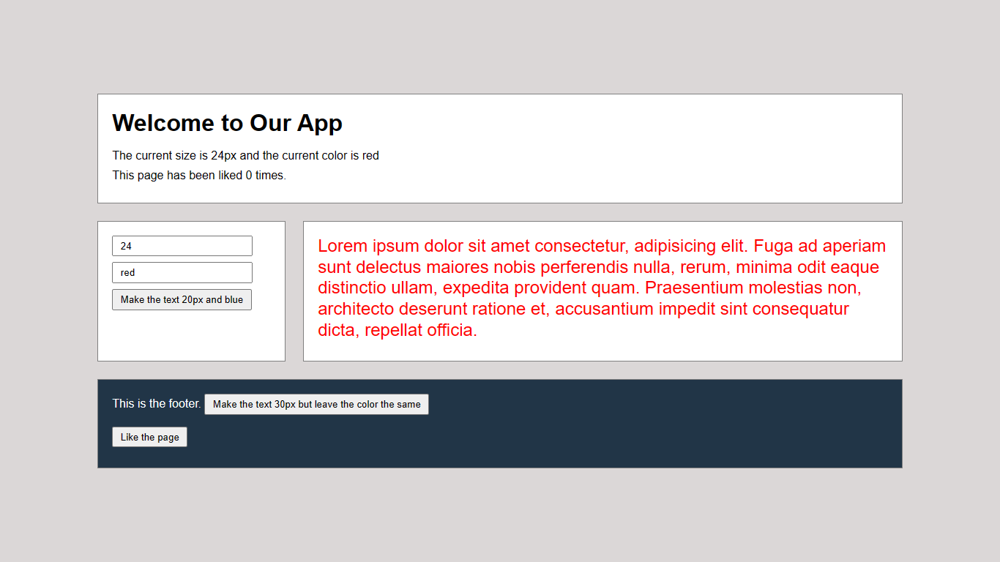

# REACT STATE MANAGEMENT PROJECT

## Table of Contents :

1. [What is State](#what-is-state?)
1. [Installation](#start-the-project)
1. [useContext](#usecontext-hook)
1. [useReducer](#usereducer-hook)
1. [Final look](#a-final-look-at-the-project)

---

### What is State?

Every interactive app involves responding to events, like when the user clicks a button, and a sidebar closes. Or someone sends a message, and it appears in a chat window.

As these events happen, and the app is updated to reflect them, we say the state of the app has changed. The app looks different than it did before, or it’s in a new mode behind the scenes.

---

### Start The Project

- Create React App using Vite frontend build tooling

```bash
    npm create vite@latest
```

- You can also directly specify the project name and the template you want to use via additional command line options

```bash
    npm create vite@latest my-react-app --template react
```

- Install project dependencies

```bash
    npm install
```

- Start the local server

```bash
    npm run dev
```

---

### useContext hook

Context provides a way to pass data or state through the component tree without having to pass props down manually through each nested component. It is designed to share data that can be considered as global data for a tree of React components.

So useContext hook helps to make the code more readable, less verbose and removes the need to introduce Consumer Component.

1. create useContext

```javascript
import { createContext } from "react";
const AppContext = createContext(null);
export default AppContext;
```

2. use useContext in App.js file and Provide states

```javascript
    import AppContext from './AppContext'
    <AppContext.Provider value={{  size, color... }}>
        <Component  />
        <Component />
    </AppContext.Provider>
```

3. insert useContext inside Component file

```javascript
import AppContext from "./AppContext";
import { useContext } from "react";

const { size, color } = useContext(AppContext);
```

---

### useReducer hook

The useReducer Hook is used to store and update states, just like the useState Hook. It accepts a reducer function as its first parameter and the initial state as the second. useReducer returns an array that holds the current state value and a dispatch function to which you can pass an action and later invoke it.

---

### A final look at the project


